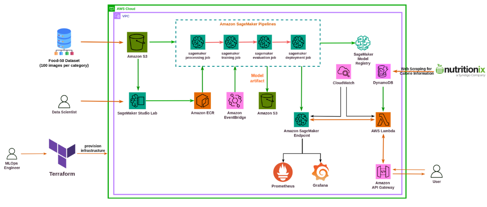

# Deep Learning Project for Meal Detection and Calorie Estimation with an Automated MLOps Pipeline using AWS SageMaker

This repository contains an end-to-end MLOps pipeline for training, deploying, and maintaining a food image classification model with calorie estimation in AWS SageMaker. The project uses AWS SageMaker, Lambda, API Gateway, DynamoDB, and other AWS services, integrated with CI/CD pipelines for automation.

## Table of Contents
- [Overview](#overview)
- [Architecture](#architecture)
- [Setup](#setup)
- [Train and Deploy the Model](#train-and-deploy-the-model)
- [CI/CD Pipeline](#cicd-pipeline)
- [Monitoring the Deployed Model](#monitoring)
- [License](#license)

## Overview

This project implements a deep learning-based food classification model that detects food items from images and estimates their calorie content by looking up the nutritional data stored in DynamoDB. It also includes MLOps practices to automate model retraining and deployment using Terraform, Docker, and GitLab CI/CD.

Key technologies and tools:
- **AWS SageMaker**: For model training, deployment, and inference.
- **Amazon S3**: For storing datasets and model artifacts.
- **DynamoDB**: For storing nutritional data.
- **Lambda & API Gateway**: For serving predictions and calorie estimations.
- **Terraform**: For managing AWS infrastructure.
- **GitLab CI/CD**: For continuous integration and deployment pipelines.

## Architecture

The diagram below shows the architecture of the project:



1. **S3**: Stores training and test data.
2. **SageMaker**: Trains the model and deploys the inference endpoint.
3. **Lambda & API Gateway**: Expose the model as an API for predictions.
4. **DynamoDB**: Stores calorie information for food items.
5. **CI/CD**: Automated retraining, testing, and deployment with GitLab CI/CD.
6. **Terraform**: Automates the creation of AWS resources.
7. **CloudWatch**: For monitoring the model and system metrics.

## Setup

### Prerequisites

To run this project, you'll need:
- An AWS account with permissions to use SageMaker, Lambda, API Gateway, S3, and DynamoDB.
- Docker installed on your local machine.
- Terraform installed for infrastructure automation.
- A GitLab account with CI/CD pipelines configured.

Follow these steps to set up the environment and infrastructure:

### **Clone the Repository**

```bash
git clone <https://github.com/NozomiLb/mlops-sagemaker-aws.git >
cd <mlops-sagemaker-aws >
```

### **Configure Terraform Variables**

Navigate to the terraform/ directory and update the terraform.tfvars file with your AWS region and desired resource names.

```bash
cd terraform
nano terraform.tfvars
```

### **Initialize and Apply Terraform**

```bash
terraform init
terraform apply
```

This will create the following resources:

 - S3 bucket for storing data and model artifacts.
 - SageMaker notebook for model training.
 - SageMaker pipelines for model deployment.
 - DynamoDB table for calorie information storage.
 - Lambda functions and API Gateway for inference.


## Train and Deploy the Model

### Training the Model

**Start a SageMaker Notebook:**
- Launch the SageMaker notebook created by Terraform.
- Upload your training script and dataset to the notebook.
- Run the training script to begin the training process.

**Preprocessing:**
- Use SageMaker Processing Jobs to preprocess your food images.
- Store processed data in your S3 bucket.

### Deploying the Model

**Create a SageMaker Endpoint:**
- After training, deploy the model by creating a SageMaker endpoint from the notebook.
- This will expose the model for real-time inference.

**Invoke the Endpoint:**
- Test your endpoint by invoking it via AWS CLI or directly from the notebook.

## CI/CD Pipeline

### Automating the Workflow
The CI/CD pipeline uses GitLab CI to automate training, building, and deploying the model.

**Set up GitLab CI:**
- Push the repository to GitLab.
- Define the `.gitlab-ci.yml` file for automating model testing, building Docker images, and deploying to SageMaker.

**Pipeline Stages:**
- **Build Stage:** Builds the Docker container for training and inference.
- **Test Stage:** Runs automated tests, including unit tests and model accuracy tests.
- **Deploy Stage:** Deploys the Docker image to SageMaker for training, and updates the SageMaker endpoint.

**Running the Pipeline:**
- Every push to the GitLab repository triggers the pipeline.
- You can monitor the pipeline progress in the GitLab CI/CD dashboard.

## Monitoring the Deployed Model

### AWS CloudWatch
You can monitor model performance and Lambda invocations using Amazon CloudWatch. It helps you track:
- **Invocation Count:** Number of times the SageMaker endpoint is called.
- **Latency:** Time taken for the model to return predictions.
- **Model Accuracy:** Track inference accuracy over time.

### Custom Monitoring with Prometheus and Grafana
For additional insights, you can set up Prometheus and Grafana dashboards to visualize SageMaker and API Gateway metrics. Prometheus can scrape data, and Grafana can display performance over time.

## License
This project is licensed under the MIT License. See the LICENSE file for more details.
